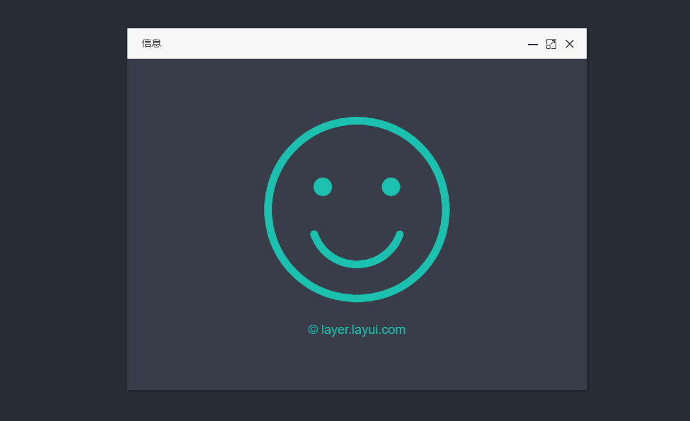

## 🎉 layui 弹层组件 - layui.layer React 封装 V0.0.1 🎉



## 📦 安装

```bash
npm i react-layui-layer --save
```

## 🔨 示例

```jsx
import Layer from 'react-layui-layer';
```
```jsx
showWindow = () => {
     this.setState({
         isShow: true
     });

 };
onCancel = () => {
     this.setState({
         isShow: false
     });

 };
```
```jsx
   render() {
        const {isShow,isShow2,windowsArray} = this.state;
        console.log(isShow2);
        return (
            <div className="App">
                <button onClick={this.showWindow}>打开窗口</button>
                <Layer visible={isShow} onCancel={this.onCancel}>
                         <span>测试数据</span>
                </Layer>
             </div>
        )
   }
```

## 📚 文档

| 参数        | 说明   |  类型  | 默认值  |
| --------   | -----  | :----:  |:----:  |
| visible | 是否显示窗体 | Boolean | false |
| shade  | 遮罩 即弹层外区域。例如0.3为透明度0.3的黑色背景('#000')  |   number    |  0   |
| type | 基本层类型 可传入的值有：1（页面层，子节点为dom）2（iframe层，子节点为地址） |  Number    |  1  |
| title  | 标题 弹出框的标题 |  string  |   -  |
| maxmin | 最大最小化 该参数值对该参数值对type:1 type:2 有效，默认显示最大小化按钮。 |Boolean|true|
| width |窗体宽度 |string| 800px|
| height |窗体高度 |string| 500px|
| onCancel | 当关闭窗体时回调方法 | function | - |